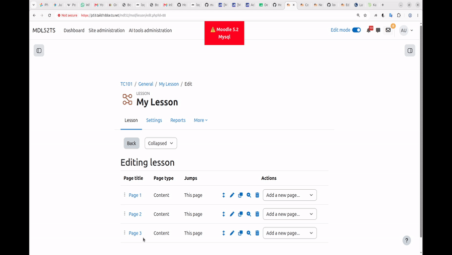

# local_lessontweak

Companion plugin that improves **mod_lesson** with **zero core modifications**.
First feature: **drag-to-reorder pages** in the collapsed lesson editor.



## How it works (no core changes)

1. `db/hooks.php` listens to the core output hook
   `\core\hook\output\before_footer_html_generation`.
2. `classes/hook_callbacks.php` bails unless the current page is
   `mod/lesson/edit.php`, the activity is a lesson, the feature is enabled, and
   the user has `mod/lesson:edit`. Then it loads the AMD module, passing the
   course-module id and sesskey.
3. `amd/src/dragreorder.js` finds the editor table (its title cells contain
   `<a id="lesson-<pageid>">`), makes the rows draggable, and reorders them in the
   DOM as you drag.
4. On drop it reads the new order and navigates to the lesson module's **existing**
   move action:
   `mod/lesson/lesson.php?id=<cmid>&sesskey=<key>&action=moveit&pageid=<pid>&after=<afterpid>`
   (`after=0` means move to the top). The server reorders and reloads the editor.

No lesson core file is touched. The only server endpoint used is the one lesson
already exposes for its "Move" links.

## Files

```
local/lessontweak/
├── version.php
├── settings.php                       # admin toggle: enable drag-reorder
├── styles.css                         # grip + dragging styles
├── lang/en/local_lessontweak.php
├── db/hooks.php                       # before_footer listener
├── classes/hook_callbacks.php         # context guard + js_call_amd
├── classes/privacy/provider.php       # null_provider (stores no personal data)
└── amd/
    ├── src/dragreorder.js             # readable ES6 source
    └── build/dragreorder.min.js       # AMD module Moodle actually serves
```

## Install

1. Copy this folder to `local/lessontweak` in your Moodle root.
2. *Site administration → Notifications* to install.
3. *Site administration → Plugins → Local plugins → Lesson tweaks* — the
   drag-reorder toggle is on by default.

## Usage

Open any lesson → **Edit → Collapsed**. Each page row gets a drag grip; drag a
row to a new position and release. The page reloads with the new order saved.

## Notes / limits

- Enhances the **collapsed** editor (the standard page table). The expanded editor
  uses different markup and is out of scope for this first version.
- Reorder persists through lesson's own move action, so permissions, events and
  sesskey checks are all handled by core lesson.
- Rebuild JS after editing the source with `grunt amd --root=local/lessontweak`
  (a pre-built `amd/build` file is shipped so it works without grunt).

## Why this exists

Demonstrates the "no core modification" path for improving lesson: a core output
hook to inject behaviour + JavaScript that drives lesson's existing endpoints. See
`mod/lesson/poc/no_core_improvements.md` for the wider catalogue of callback/JS
improvements, and `mod/lesson/poc/options.md` for the changes that *do* need core
(new scored question types, question-bank sharing).
